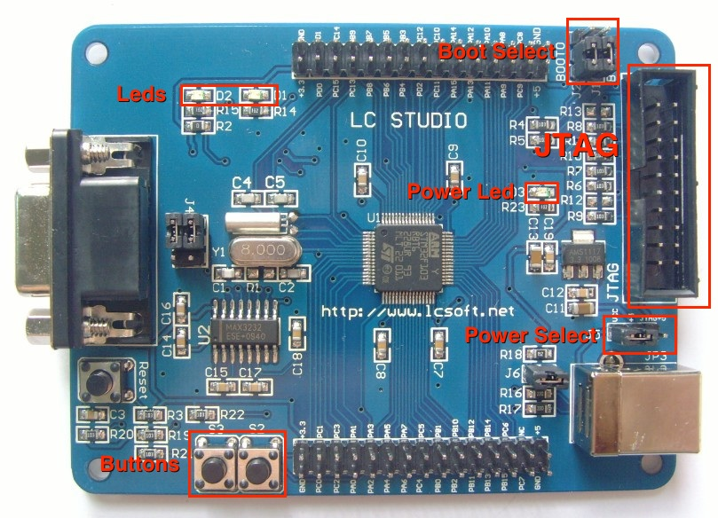
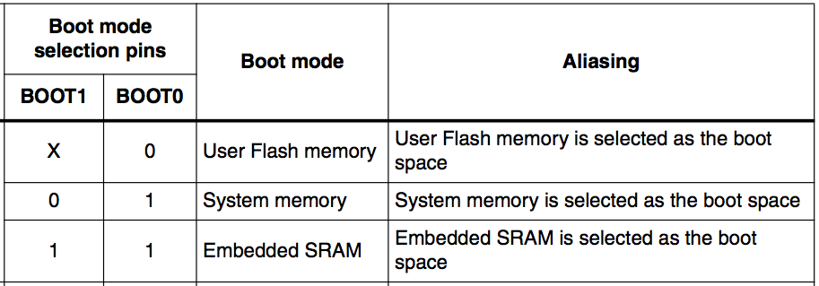
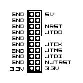

# How to flash an ARM board

This is intended to be a comprehensive example on how to flash an ARM-based board. Since that is such a broad topic, I want to give an example of doing so with a given set of tools, environment and board, and let readers adapt it to fit their needs.

## Board

The board used in this tutorial features an ARM Cortex-M3 microcontroller manufactued by STMicroelectronics (STM). The microcontroller model is from the STM32F1 family. The exact model name is STM32F103RBT6.

The board itself is manufactured by a chinese company specialized in prototyping boards called [LC Studio](http://www.lctech-inc.com/Hardware/Detail.aspx?id=91891ab7-5724-4526-abfa-958df9ce571f). This or a similar board can be acquired on Ebay for about $10-$20 ([Ebay search for STM32F103R](http://www.ebay.com/sch/i.html?_trksid=p2050601.m570.l1313.TR0.TRC0.X++STM32F103R&_nkw=++STM32F103R&_sacat=0&_from=R40)).

Under the `docs` folder you can find the datasheet of the microcontroller and the schematics of the board.

## Setup

First, we are going to setup our environment with some required tools: the compiler and the flasher. I am going to use Mac OSX 10.9 but all these tools should work with previous versions (down to 10.6.8 maybe) and most linux distributions.

The compiler is a special version of GCC maintained by ARM employees. There are precompiled versions for Mac and Linux. I recommend against installing it through a package manager like Homebrew (OSX) or Apt-get (Ubuntu and other Linux distributions) since it can mess with your current installation of GCC by overriding your aliases or PATH.

Download the installation tarball for Mac or OSX from the following link:

[https://launchpad.net/gcc-arm-embedded/+download](https://launchpad.net/gcc-arm-embedded/+download)

OpenOCD is the flasher tool we're going to use to send the compiled binary to our JTAG programmer, which in turn will flash it to our ARM board.

The easiest way to get it on OSX is through Homebrew. See how to get Homebrew [here](http://brew.sh). Then run `brew install openocd` to get the flasher.

## Compiling the code

Now to the fun part, lets see some code. Since the board comes with two programmable buttons and two leds, our program will turn on one led while we press one button, and do the same with the other.

This example is by Mindaugas from the [ScienceProg Blog](http://www.scienceprog.com/project-demo-on-stm32f103rbt6-using-gcc/). Check it out, some nice electronics and programming tutorials there.

Let me explain what the important files inside `src` do:

| Path | Desription |
| ---- | ---------- |
| main.c | This is where the `main()` function is defined, and is the main code of our program |
| Libraries/CMSIS/ | CMSIS is a library by ARM that standarizes access to certain hardware interfaces across different ARM microcontrollers |
| Libraries/STM32F10x_StdPeriph_Driver/ | The ST "Standard Peripheral Library" is a library that further simplifies the interface provided to the programmer for STM32 microcontrollers. |
| Libraries/Drivers/ | The purpose of these scripts is to create wrappers around lower level functions for interacting with buttons and leds |

To compile the code you will need to add the compiler to your PATH (change the path to the appropriate path where you unzipped the compiler):

`export PATH=$PATH: /path/to/the/compiler/gcc-arm-none-eabi-4_8-2013q4/bin`

We're ready to compile. Go to the `src` directory and type `make`. If everything went right you should have a `main_rom.elf` file inside the `src` directory.

NOTE: In the unlikely case that you don't have `make` installed, install Xcode on your Mac or type `sudo apt-get install build-essential` on Ubuntu.

## Preparing OpenOCD

To actually transfer your program to the board through JTAG, you will need an external piece of hardware, a JTAG programmer. In this example I'm going to use a [Buspirate](http://dangerousprototypes.com/docs/Bus_Pirate), but you can use any programmer supported by OpenOCD. You can find a list of supported interfaces [here](http://openocd.sourceforge.net/doc/html/Debug-Adapter-Configuration.html).

OpenOCD is responsible for talking to this hardware programmer, which it calls "interface", and make it flash your board.

To do this, OpenOCD uses the `flash.cfg` file located inside the `src` directory. Let's take a look at this file.

First we're going to declare the interface we're going to use. In this case we select the Buspirate interface. Sometimes the interface requires further configuration, like specifying the serial port in which it is connected.

To find this in OSX, run `ls /dev/tty.*` in your terminal and copy the path which does not contain Bluetooth in its name. In case you have more than one serial device connected you will have to find which one it is.

```
source find interface/buspirate.cfg
buspirate_port /dev/tty.usbserial-A901LS62
```

Next we select the target board where we want to flash our program, in this case it's from the stm32f1x family.

```
source [find target/stm32f1x.cfg]
```

The rest of the code will attach to our board, erase the memory, and flash the new contents. In this line, we specify the file that contains our compiled program.

```
flash write_image main_rom.elf
```

## Preparing the board

Every board is different and exposes different features through various interfaces. However there are some things common to almost all boards. In the photo below you can see the relevant parts of the board we're going to learn about.



- Power Select: the board can be powered through USB or directly from the JTAG programmer. For some reason I couldn't power it from JTAG so I did it through USB. These headers let us select the power mode. In the position of the image it powers from USB, and from JTAG in the other position.

- Power led: this led will turn on when the board is on. And obviously it must be on to be flashed :).

- Leds and Buttons: these are the leds and buttons our program controls.

- JTAG: the JTAG headers. In the next part we're going to connect our programmer to some of these pins.

- Boot Select: Our board can operate in three modes, which we can select setting the BOOT0 and BOOT1 jumpers appropiately. As in the photo above, both BOOT0 and BOOT1 and in low or 0 position.



To flash the board, we have to select system memory boot (BOOT0 = 1, BOOT1 = 0). To run your program we have to select user memory (BOOT0 = 0, BOOT1 = 0).

## Wiring

We're going to wire our programmer to the board. In our board, the layout of the JTAG pins is as follows (Note the orientation due to the lateral opening):



This is the mapping between Buspirate and JTAG pins:

| Buspirate | JTAG |
| --------- | ---- |
| GND       | GND  |
| MOSI      | JTDI |
| MISO      | JTDO |
| CLK       | JTCK |
| CS        | JTMS |

# Flashing

The final step. Connect the programmer and the board to USB ports in your computer. Then run OpenOCD with our `flash.cfg` configuration file:

`openocd -f path/to/flash.cfg`

NOTE: Remember to set the BOOT0 jumper before powering on the board.

The output should be similar to this:

```
Open On-Chip Debugger 0.8.0-dev-00019-g452df03-dirty (2013-06-04-09:26)
Licensed under GNU GPL v2
For bug reports, read
	http://openocd.sourceforge.net/doc/doxygen/bugs.html
Warn : Adapter driver 'buspirate' did not declare which transports it allows; assuming legacy JTAG-only
Info : only one transport option; autoselect 'jtag'
srst_only separate srst_gates_jtag srst_open_drain connect_deassert_srst
adapter speed: 1000 kHz
adapter_nsrst_delay: 100
jtag_ntrst_delay: 100
cortex_m3 reset_config sysresetreq
Info : Buspirate Interface ready!
Info : This adapter doesn't support configurable speed
Info : JTAG tap: stm32f1x.cpu tap/device found: 0x3ba00477 (mfg: 0x23b, part: 0xba00, ver: 0x3)
Info : JTAG tap: stm32f1x.bs tap/device found: 0x16410041 (mfg: 0x020, part: 0x6410, ver: 0x1)
Info : stm32f1x.cpu: hardware has 6 breakpoints, 4 watchpoints
target state: halted
target halted due to debug-request, current mode: Thread
xPSR: 0x81000000 pc: 0x1ffff3b6 msp: 0x200000c4
Info : device id = 0x20036410
Info : flash size = 128kbytes
Info : device id = 0x20036410
Info : flash size = 128kbytes
flash 'stm32f1x' found at 0x08000000
cleared protection for sectors 0 through 127 on flash bank 0
Info : JTAG tap: stm32f1x.cpu tap/device found: 0x3ba00477 (mfg: 0x23b, part: 0xba00, ver: 0x3)
Info : JTAG tap: stm32f1x.bs tap/device found: 0x16410041 (mfg: 0x020, part: 0x6410, ver: 0x1)
target state: halted
target halted due to debug-request, current mode: Thread
xPSR: 0x61000000 pc: 0x2000003a msp: 0x200000c4
stm32x mass erase complete
wrote 2796 bytes from file main_rom.elf in 2.988482s (0.914 KiB/s)
set protection for sectors 0 through 127 on flash bank 0
requesting target halt and executing a soft reset
target state: halted
target halted due to breakpoint, current mode: Thread
xPSR: 0x01000000 pc: 0x1ffff020 msp: 0x200001fc
shutdown command invoked
Info : Shutting down buspirate.
Info : Buspirate switched to normal mode
```

If everything went right, you can switch back the BOOT0 jumper and power the board. Now press the buttons and see if the leds turn on.

Did they turn on? Congratulations, you can now start trying your ARM programming skills on an actual board.

They didn't? Well, hardware is hard. First try disconnecting and connecnt the USBs and trying again, just in case. If that didn't work either, read the error messages. Seriously read them. The most probable causes are:

- Incorrect configuration of your programmer in OpenOCD: Check the configuration file for your interface. If you installed OpenOCD from Homebrew, the interface files should be in `/usr/local/Cellar/open-ocd/0.7.0/share/openocd/scripts/interface`. Check if you need to setup some additional config.

- Incorrect JTAG wiring: disconnect all cables and wire then again.

Finally, remember Google is your friend. Whatever your combination of board/programmer/tools is, someone has probably done it before :).
